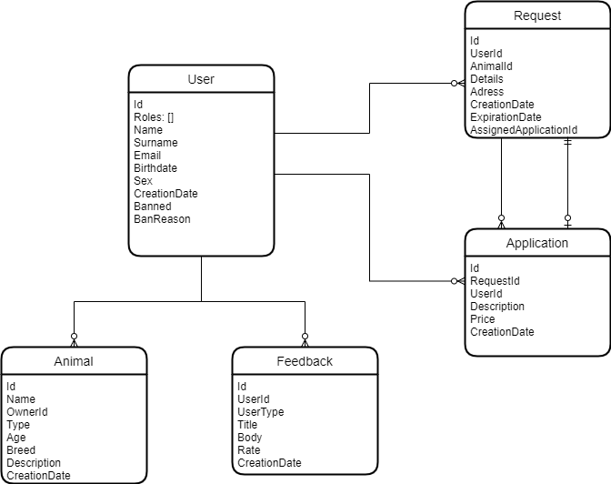

# Pet home

  

## Idea 
The idea of out project is to create application which will help people who are looking for a temporary house for their pets, find it. Others can earn money or simply take care of pets. This project is high relevant nowadays, because a lot of people had to leave their houses and some of them left their pets without food and water.

## Roles
There are four roles in our system:
  1. Owner, the owner of the pet.
  2. Holder, person, who agreed to look after the pet.
  3. User, includes two previous roles, that has certain possibilities.
  4. Admin, manages the system.

## Functionality
They have different permissions and functionally.

### Owner
Owner has the following features:
  1. Add pet to his zoo.
    Acceptance criteria: max count is 10
  2. Edit information about his pet.
  3. Delete pet from his zoo.
  4. Create advertisement.
    Acceptance criteria: user must have at least one pet
  5. Edit advertisement.
    Acceptance criteria: nobody of holder left request for advertisement.
  6. Delete advertisement.
    Acceptance criteria: advertisement is not in progress and not completed.

### Holder
The holder has the following features:
  1. See the list of advertisement to choose one of them.
  2. Send request to complete an advertisement.
  3. Discard request.
  ... in progress

### User
User can:
  1. Register in system with email, password and role.
  2. Login into system with email and password.
  3. Reset his password with email.

### Admin
Admin manages the hole system, so he can do all CRUD operations with Users and Pets.

## Technology stack:
1. NestJs + Typescript 
    When beginning a new Node.js project, NestJS is a much better choice than
    ExpressJS since it is built on a clear design with a few simple components
    (controllers, modules, and providers).
    Typescript brings clarity to the project, which is a key point of collaboration in our team.

2. MongoDB + Mongoose 
    Mongoose module is one of the most powerful external modules of NodeJS.
    Mongoose is a MongoDB ODM i.e (Object database Modelling) that used to
    translate the code and its representation from MongoDB to the Node.js server.

3. Auth: - (3rd party) As a 3rd party auth provider we will use Firebase Auth.
    It's a reliable and easy-to-use solution, especially for small applications.
## Database schema

